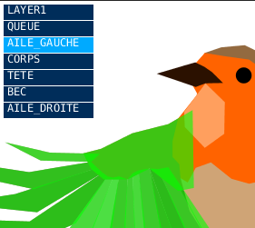
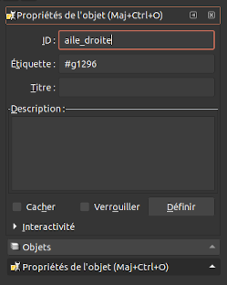
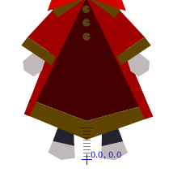
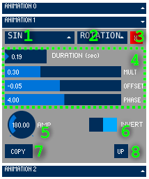

# SgAnimator
Outil d'animation d'images vectorielles pour les jeux vidéo. 
Fonctionne avec les fichiers vectoriels au format **SVG**. Les données créées par le logiciel (geométrie et données d'animation) sont sauvergardées au format **json**. Ce format permet la modification directe des paramètres d'animation avec un éditeur de texte simple.

## Préparation des illustrations vectorielle (SVG)
### Conversion des objets en chemin
Si vous essayez d'ouvrir un fichier SVG avec le logiciel d'animation il est probable que beaucoup d'objets ne soient pas affichés correctement. Ceci est dû aux limitations inhérentes à la bibliothèque de Processing (le langage dans lequel est programmé le logiciel d'animation). Pour contourner ce problème, il est nécessaire de convertir tous les objets graphiques en chemin (*path*) depuis votre logiciel d'illustration vectorielle. 
(Actuellement, seuls les objects de type *path* (chemin) et les objets de type *circle* (cercle) sont reconnus par le logiciel) 
Pour convertir un objet en chemin dans Inkscape : <kbd>Maj</kbd>+<kbd>Ctrl</kbd>+<kbd>C</kbd> ou bien par le menu `Chemin > Objet en chemin`, après avoir selectionné les objets à convertir.
### Organisation des objets en groupes

Seul les **groupes** d'objets apparaissent comme des parties indépendantes et animables dans le logiciel d'animation (liste de gauche). Si aucun groupe n'a été définit dans l'illustration vectorielle, vous ne pourrez animer l'illustration que comme un objet monolithique et n'aurez pas accès à ses sous-parties. 

Dans le logiciel Inkscape, La création de groupes d'objets se fait par la combinaison des touches <kbd>Ctrl</kbd>+<kbd>G</kbd> ou bien par le menu `Objet > Grouper`, après avoir sélectionné les différents objets à regrouper ensemble. 
Il peut être pratique de nommer les groupes créés afin de faciliter leur sélection dans la liste des parties animables. Dans Inkscape, sélectionnez le groupe puis accédez à ses propriétés avec la combinaison de touches <kbd>Maj</kbd>+<kbd>Ctrl</kbd>+<kbd>O</kbd> bien par le menu `Objet > Propriétés de l'objet...`. Modifiez l'attribut "ID" pour renommer le groupe. 

Un groupe peut contenir, en plus d'objets simples, d'autres sous-groupes. Vous pourrez ainsi animer chaque sous-groupe d'une façon indépendante (Ex : les doigts d'une main) et chaque sous-groupe sera affecté de la même manière par l'animation du groupe parent (lorsque la main bouge, les doigts se déplacent avec la main). 
C'est donc l'organisation des groupes qui définit le "rigging" (squelettage) le l'illustration. On organise les groupes de façon hiérarchique en partant des extrémités pour aller vers la raçine. (Pour reprendre notre exemple : chaque doigt est un groupe contenu dans le groupe "main", lui-même contenu dans le groupe "avant-bras", lui-même contenu dans le groupe "bras"...)

## Repositionnement du modèle ou de ses parties

Vous pouvez déplacer chaque partie relativement aux autres en maintenant la touche <kbd>Maj</kbd> et le bouton gauche de la souris enfoncée. Relachez le bouton <kbd>Maj</kbd> à l'emplacement voulu. 
Il est important de centrer le modèle entier (en sélectionnant le premier groupe dans le menu de gauche) par rapport à l'origine afin de faciliter le placement du modèle dans le monde virtuel de votre jeu. 

## Placement des points de pivot
Chaque partie selectionnable dans le logiciel d'animation possède un point d'origine ou point de pivot (situé aux coordonnées 0,0 par défaut), représenté par un point bleu. 
Le placement du point de pivot affecte les animations de type rotation et étirements. 
Pour modifier l'emplacement du point de pivot de la partie active, faites un click droit pour ouvrir le menu contextuel et choisissez `set pivot`. Clickez ensuite à l'endroit où vous voulez placer le pivot.

## Fonctions d'animation

Chaque partie selectionnable dans la liste de gauche peut-être animée par une ou plusieurs fonctions d'animation. 
Une fonction renvoie une valeur simple qui peut varier en fonction de temps. Pour qu'une fonction anime un objet, il faut également choisir un axe sur lequel s'appliquera la valeur de la fonction.

> 1. Choix de la fonction
> 2. Choix de l'axe
> 3. Supprimer l'animation
> 4. Paramètres de la fonction
> 5. Copier l'animation
> 6. Coller l'animation précédemment copiée
> 7. Monter/Descendre l'animation dans la pile

Les différents axes sur lesquels s'appliquent les fonctions d'animation sont : 

* **X** (l'axe horizontal)
* **Y** (l'axe vertical)
* **Rotation** (rotation en degrées autour d'un point de pivot)
* **Scale X** (étirement horizontal avec le point de pivot pour origine)
* **Scale Y** (étirement vertical avec le point de pivot pour origine)
* **Zoom** (étirement dans les deux dimensions avec le point de pivot pour origine)

### Constant
Transformation statique (ne varie pas avec le temps).
Pratique pour redimensionner certaines parties (avec les axes "scale") à l'avant d'autres fonctions d'animation.
### EasingFromTo
### Timetable
Permet de créer une suite de déplacement unidimensionelle en plusieurs étapes (entre 4 et 32). 
#### Paramètres
* *Num steps* définit le nombre d'étapes dans l'animation (entre 4 et 32)
* *Smooth end* transition souple entre la dernière étape et la première étape (rajoute une étape)
* *Loop* l'animation est jouée en boucle
### Sin
### Spin
Fonction pour créer une rotation permanente (avec l'axe "rotation"). Permet d'animer les pales d'un moulin à vent par exemple.
### RandomEase
### RandomBlink
