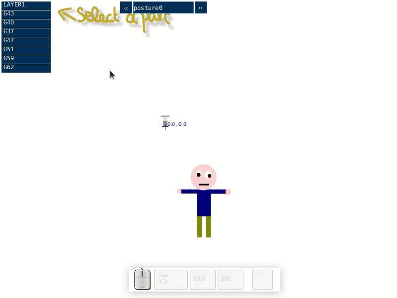

# SgAnimator
Outil d'animation d'images vectorielles pour les jeux vidéo. 
Fonctionne avec les fichiers vectoriels au format **SVG**. Les données créées par le logiciel (geométrie et données d'animation) sont sauvergardées au format **json**. Ce format permet la modification directe des paramètres d'animation avec un éditeur de texte simple.

## Préparation des illustrations vectorielle (SVG)
### Conversion des objets en chemins
Si vous essayez d'ouvrir un fichier SVG avec le logiciel d'animation il est probable que beaucoup d'objets ne soient pas affichés correctement. Ceci est dû aux limitations inhérentes à la bibliothèque de Processing (le langage dans lequel est programmé le logiciel d'animation). Pour contourner ce problème, il est nécessaire de convertir tous les objets graphiques en chemin (*path*) depuis votre logiciel d'illustration vectorielle. 
(Actuellement, seuls les objects de type *path* (chemin) et les objets de type *circle* (cercle) sont reconnus par le logiciel) 
Pour convertir un objet en chemin dans Inkscape : <kbd>Maj</kbd>+<kbd>Ctrl</kbd>+<kbd>C</kbd> ou bien par le menu `Chemin > Objet en chemin`, après avoir selectionné les objets à convertir.
### Organisation des objets en groupes

Seul les **groupes** d'objets apparaissent comme des parties indépendantes et animables dans le logiciel d'animation (liste de gauche). Si aucun groupe n'a été définit dans l'illustration vectorielle, vous ne pourrez animer l'illustration que comme un objet monolithique et n'aurez pas accès à ses sous-parties. 

Dans le logiciel Inkscape, La création de groupes d'objets se fait par la combinaison des touches <kbd>Ctrl</kbd>+<kbd>G</kbd> ou bien par le menu `Objet > Grouper`, après avoir sélectionné les différents objets à regrouper ensemble. 
Il peut être pratique de nommer les groupes créés afin de faciliter leur sélection dans la liste des parties animables. Dans Inkscape, sélectionnez le groupe puis accédez à ses propriétés avec la combinaison de touches <kbd>Maj</kbd>+<kbd>Ctrl</kbd>+<kbd>O</kbd> bien par le menu `Objet > Propriétés de l'objet...`. 
Modifiez l'attribut "ID" pour renommer le groupe. 

Un groupe peut contenir, en plus d'objets simples, d'autres sous-groupes. Vous pourrez ainsi animer chaque sous-groupe d'une façon indépendante (Ex : les doigts d'une main) et chaque sous-groupe sera affecté de la même manière par l'animation du groupe parent (lorsque la main bouge, les doigts se déplacent avec la main). 
C'est donc l'organisation des groupes qui définit le "rigging" (squelettage) le l'illustration. On organise les groupes de façon hiérarchique en partant des extrémités pour aller vers la racine. 
(Pour reprendre notre exemple : chaque doigt est un groupe contenu dans le groupe "main", lui-même contenu dans le groupe "avant-bras", lui-même contenu dans le groupe "bras"...)

## Placement des points de pivot
Chaque partie selectionnable dans le logiciel d'animation possède un point d'origine ou point de pivot (situé aux coordonnées 0,0 par défaut), représenté par un point bleu. 
Le placement du point de pivot affecte les animations de type rotation et étirements. 
Pour modifier l'emplacement du point de pivot de la partie active, faites un click droit pour ouvrir le menu contextuel et choisissez `set pivot`. Clickez ensuite à l'endroit où vous voulez placer le pivot.

## Repositionnement/redimensionnement du modèle ou de ses parties
Vous pouvez déplacer chaque partie relativement aux autres en maintenant la touche <kbd>Maj</kbd> et le bouton gauche de la souris enfoncée. Relachez le bouton <kbd>Maj</kbd> à l'emplacement voulu. 
Il est important de centrer le modèle entier (en sélectionnant le premier groupe dans le menu de gauche) par rapport à l'origine afin de faciliter le placement du modèle dans le monde virtuel de votre jeu. 

On peut, de la même façon, redimensionner chaque partie en maintenant la touche <kbd>Maj</kbd> et en tournant la molette de la souris. La mise à l'échelle d'une partie se fait par rapport à son point de pivot (origin de la transformation).

## Fonctions d'animation
Chaque partie selectionnable dans la liste de gauche peut-être animée par une ou plusieurs fonctions d'animation. 
Une fonction renvoie une valeur simple qui peut varier en fonction de temps. Pour qu'une fonction anime un objet, il faut également choisir un axe sur lequel s'appliquera la valeur de la fonction.

> 1. Choix de la fonction
> 2. Choix de l'axe
> 3. Supprimer l'animation
> 4. Paramètres de la fonction
> 5. Modifier l'amplitude générale de l'animation
> 6. Inverser l'animation (pratique pour créer des animations symétriques)
> 7. Copier/coller l'animation
> 8. Monter/Descendre l'animation dans la pile

Les différents axes sur lesquels s'appliquent les fonctions d'animation sont : 

* **X** (l'axe horizontal)
* **Y** (l'axe vertical)
* **Rotation** (rotation en degrées autour d'un point de pivot)
* **Scale X** (étirement horizontal avec le point de pivot pour origine)
* **Scale Y** (étirement vertical avec le point de pivot pour origine)
* **Zoom** (étirement dans les deux dimensions avec le point de pivot pour origine)

L'animation est réinitialisée lorsqu'on modifie un de ses paramètres dans la liste de droite. Ceci peut créer un décallage avec les animations des autres parties, qui continuent à progresser normalement. Pour re-synchroniser toutes les animations ensemble vous pouvez appuyer sur la touche <kbd>r</kbd>.

### Constant
Transformation statique (ne varie pas avec le temps).
Pratique pour redimensionner certaines parties (avec les axes "scale") à l'avant d'autres fonctions d'animation.
### EasingFromTo
Interpolation entre deux valeurs avec différentes fonctions de transition.

| Paramètre | |
| ----- | ----- |
| *From* | Valeur de départ |
| *To* | Valeur d'arrivée |
| *Delay* | Intervale de temps entre chaque boucle de l'animation (si *loop* est actif) |
| *EaseDuration* | Intervale de temps pour effectuer la transition |
| *Easing* | Fonction de transition à utiliser (appuyer 2 fois sur la touche <kbd>h</kbd> pour avoir un apperçu des fonctions de transition) |
| *BackForth* | Effectue un va-et-vient |
| *Loop* | Joue l'animation en boucle |

### Timetable
Permet de créer une suite de déplacement unidimensionelle en plusieurs étapes. 

| Paramètre | |
| ----- | ----- |
| *Num steps* | Définit le nombre d'étapes dans l'animation (entre 4 et 32) |
| *Smooth end* | Transition douce entre la dernière étape et la première étape (rajoute une étape) |
| *Loop* | Joue l'animation en boucle |

### Sin
Mouvement sinusoïdale (idéale pour les mouvement de respiration par exemple). 
`valeur = offset + mult × sin(2×PI × t/duration + phase)`

| Paramètre | |
| ----- | ----- |
| *Duration* | Temps nécessaire pour effectuer un cycle complet (tour du cercle trigonométrique) |
| *Mult* | Amplitude du mouvement sinusoïdal |
| *Offset* | Ajoute une valeur constante à la fonction sinus |
| *Phase* | Applique un déphasage au mouvement sinusoïdale (modifie la valeur de départ) |

### Spin
Fonction pour créer une rotation permanente (avec l'axe "rotation"). Permet d'animer les pales d'un moulin à vent par exemple. 
Elle est équivalent à une fonction en dents de scie. 

| Paramètre | |
| ----- | ----- |
| *Start* | Angle initial |
| *Duration* | Durée d'un cycle |
| *Mult* | Multiplicateur de durée |

### RandomEase
Change de valeur aléatoirement et applique une transition douce entre les valeurs.

| Paramètre | |
| ----- | ----- |
| *Duration* | Durée d'un cycle |
| *Prob* | Probabilité qu'un cycle produise une nouvelle valeur aléatoire |
| *Mult* | Amplitude du mouvemnet |
| *Offset* | Décalage du mouvement |
| *Easing* | Fonction de transition à utiliser (appuyer 2 fois sur la touche <kbd>h</kbd> pour avoir un apperçu des fonctions de transition) |
| *EaseDuration* | Durée de transition entre deux valeurs |

### RandomBlink
Fonction idéale pour animer le clignement des yeux. A appliquer sur l'axe Y.

| Paramètre | |
| ----- | ----- |
| *Duration* | Durée d'un cycle |
| *Prob* | Probabilité qu'un cycle produise un clignement |
| *Mult* | Amplitude du mouvemnet |
| *Offset* | Décalage du mouvement |
